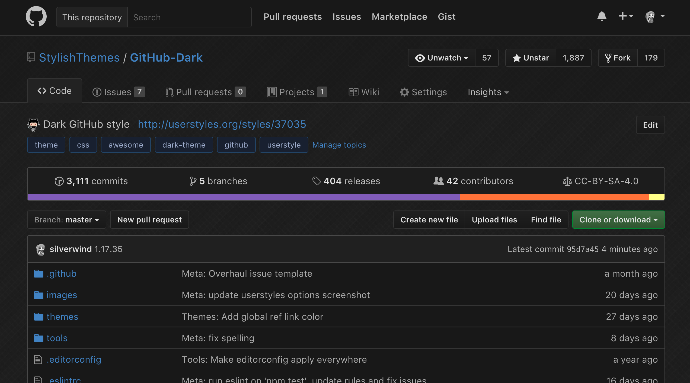

GitHub-Dark-Extensions

  
   
  
  
  
  
  

<h2 align="center">Your eyes will&nbsp;:heart:&nbsp;you.</h2>

## Preview

## Installation

Install [Stylus](https://add0n.com/stylus.html) for either [Firefox](https://addons.mozilla.org/en-US/firefox/addon/styl-us/), [Chrome](https://chrome.google.com/webstore/detail/stylus/clngdbkpkpeebahjckkjfobafhncgmne) or [Opera](https://addons.opera.com/en-gb/extensions/details/stylus/) or [Cascadea for Safari](https://cascadea.app/) and then install using one of these methods:

📦 [Install the usercss](https://raw.githubusercontent.com/StylishThemes/GitHub-Dark-Extensions/master/github-dark-extensions.user.css) which supports automatic updates and customization. 
📦 [Install manually from GitHub](https://raw.githubusercontent.com/StylishThemes/GitHub-Dark-Extensions/master/github-dark-extensions.css) with no customization, but useful for development. The style is in Mozilla format. 

## Supported GitHub Extensions

💾 [Gitako](https://github.com/EnixCoda/Gitako) 
💾 [GitHub Hovercard](https://github.com/Justineo/github-hovercard) 
💾 [GitHub Notifications Dropdown](https://openuserjs.org/scripts/joeytwiddle/Github_Notifications_Dropdown) 
💾 [GitHub Polls](https://github.com/apex/gh-polls) 
💾 [Lovely forks](https://github.com/musically-ut/lovely-forks#lovely-forks) 
💾 [npmhub](https://github.com/npmhub/npmhub) 
💾 [OctoLinker](https://github.com/OctoLinker/OctoLinker) 
💾 [Octotree](https://github.com/buunguyen/octotree/#octotree) 
💾 [Refined GitHub](https://github.com/sindresorhus/refined-github) 
💾 [ZenHub](https://www.zenhub.io/) 
💾 [Notifications Preview for GitHub](https://github.com/tanmayrajani/notifications-preview-github) 

## Contributions

If you would like to contribute to this repository, please...

1. 👓 Read the [contribution guidelines](.CONTRIBUTING.md).
1. [ Fork](https://github.com/StylishThemes/GitHub-Dark/fork) or [ download](https://github.com/StylishThemes/GitHub-Dark/archive/master.zip) this repository.
1. 👌 Create a pull request!

## Development

First, make sure you have these installed:

- [`node`](https://nodejs.org): version 12 or greater
- [`yarn`](https://classic.yarnpkg.com/en/docs/install/): version 1
- `make`: comes with Unix-like OS, on Windows use [this](https://stackoverflow.com/a/54086635/808699)

To get started, run `make deps` after which you can use the following `make` scripts:

## Development scripts

- `make build`: Runs the `generate` and `usercss` tasks.
- `make usercss`: Build the [Usercss](https://github.com/openstyles/stylus/wiki/Usercss) style.
- `make themes`: Parse the theme files and combine them into minified styles in the `themes` directory.
- `make clean`: Reformat `github-dark-extensions.css` to conform to the style guide.
- `make lint`: Run Stylelint on `github-dark-extensions.css`.
- `make authors`: Regenerate the `AUTHORS` file based on git history.
- `make generate`: Regenerate auto-generated CSS rules compiled from various public sources.
- `make update`: Update and install dependencies.

## Internal use scripts (not for pull requests)

- `make patch`: Increment the patch version number, update file headers, create a commit and push it to `origin`.
- `make minor`: Increment the minor version number, update file headers, create a commit and push it to `origin`.
- `make major`: Increment the major version number, update file headers, create a commit and push it to `origin`.

Thanks to all that have [contributed](./AUTHORS) so far!
